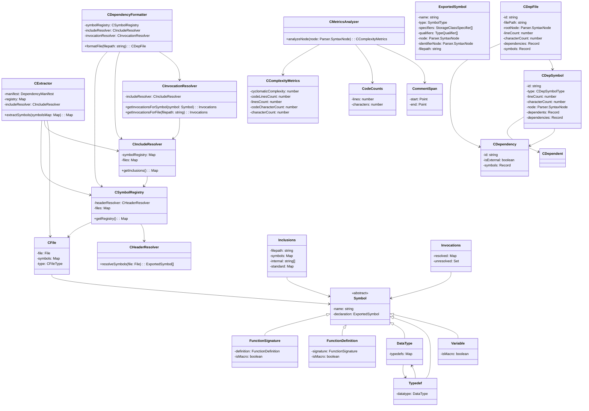

# NanoAPI C Plugin

This plugin manages parsing and mapping of dependencies in C projects.

**Warning :** This plugin relies on tree-sitter, which has an unreliable parser for C. Not every C project is entirely compatible. Warnings may be issued where tree-sitter finds errors.

## Class diagram

