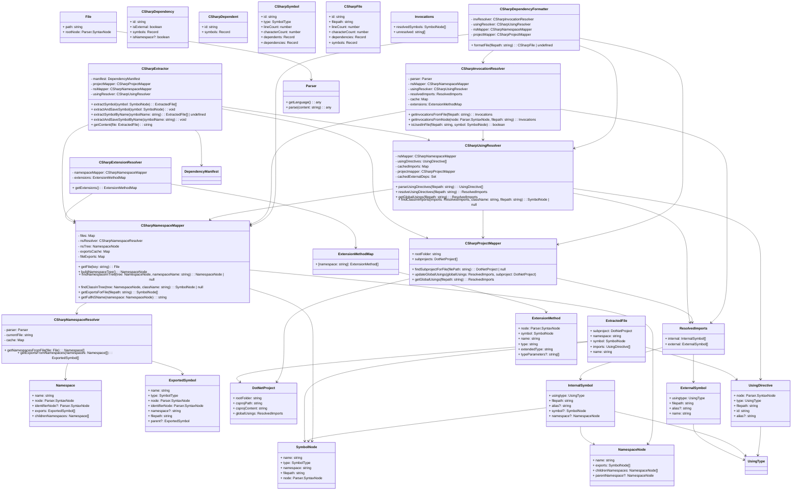

# NanoAPI C# Plugin

This plugin manages parsing and mapping of dependencies in C#/.NET projects.

## Class diagram

```mermaid
classDiagram
    class CSharpDependencyFormatter {
        - invResolver: CSharpInvocationResolver
        - usingResolver: CSharpUsingResolver
        - nsMapper: CSharpNamespaceMapper
        - projectMapper: CSharpProjectMapper
        + formatFile(filepath: string): CSharpFile | undefined
    }

    class CSharpDependency {
        + id: string
        + isExternal: boolean
        + symbols: Record<string, string>
        + isNamespace?: boolean
    }

    class CSharpDependent {
        + id: string
        + symbols: Record<string, string>
    }

    class CSharpSymbol {
        + id: string
        + type: SymbolType
        + lineCount: number
        + characterCount: number
        + dependents: Record<string, CSharpDependent>
        + dependencies: Record<string, CSharpDependency>
    }

    class CSharpFile {
        + id: string
        + filepath: string
        + lineCount: number
        + characterCount: number
        + dependencies: Record<string, CSharpDependency>
        + symbols: Record<string, CSharpSymbol>
    }

    class CSharpInvocationResolver {
        - parser: Parser
        - nsMapper: CSharpNamespaceMapper
        - usingResolver: CSharpUsingResolver
        - resolvedImports: ResolvedImports
        - cache: Map<string, Invocations>
        - extensions: ExtensionMethodMap
        + getInvocationsFromFile(filepath: string): Invocations
        + getInvocationsFromNode(node: Parser.SyntaxNode, filepath: string): Invocations
        + isUsedInFile(filepath: string, symbol: SymbolNode): boolean
    }

    class Invocations {
        + resolvedSymbols: SymbolNode[]
        + unresolved: string[]
    }

    class CSharpNamespaceMapper {
        - files: Map<string, File>
        - nsResolver: CSharpNamespaceResolver
        - nsTree: NamespaceNode
        - exportsCache: Map<string, SymbolNode[]>
        - fileExports: Map<string, SymbolNode[]>
        + getFile(key: string): File
        + buildNamespaceTree(): NamespaceNode
        + findNamespaceInTree(tree: NamespaceNode, namespaceName: string): NamespaceNode | null
        + findClassInTree(tree: NamespaceNode, className: string): SymbolNode | null
        + getExportsForFile(filepath: string): SymbolNode[]
        + getFullNSName(namespace: NamespaceNode): string
    }

    class NamespaceNode {
        + name: string
        + exports: SymbolNode[]
        + childrenNamespaces: NamespaceNode[]
        + parentNamespace?: NamespaceNode
    }

    class SymbolNode {
        + name: string
        + type: SymbolType
        + namespace: string
        + filepath: string
        + node: Parser.SyntaxNode
    }

    class CSharpNamespaceResolver {
        - parser: Parser
        - currentFile: string
        - cache: Map<string, Namespace[]>
        + getNamespacesFromFile(file: File): Namespace[]
        + getExportsFromNamespaces(namespaces: Namespace[]): ExportedSymbol[]
    }

    class Namespace {
        + name: string
        + node: Parser.SyntaxNode
        + identifierNode?: Parser.SyntaxNode
        + exports: ExportedSymbol[]
        + childrenNamespaces: Namespace[]
    }

    class ExportedSymbol {
        + name: string
        + type: SymbolType
        + node: Parser.SyntaxNode
        + identifierNode: Parser.SyntaxNode
        + namespace?: string
        + filepath: string
        + parent?: ExportedSymbol
    }

    class CSharpProjectMapper {
        + rootFolder: string
        + subprojects: DotNetProject[]
        + findSubprojectForFile(filePath: string): DotNetProject | null
        + updateGlobalUsings(globalUsings: ResolvedImports, subproject: DotNetProject)
        + getGlobalUsings(filepath: string): ResolvedImports
    }

    class DotNetProject {
        + rootFolder: string
        + csprojPath: string
        + csprojContent: string
        + globalUsings: ResolvedImports
    }

    class CSharpUsingResolver {
        - nsMapper: CSharpNamespaceMapper
        - usingDirectives: UsingDirective[]
        - cachedImports: Map<string, ResolvedImports>
        - projectmapper: CSharpProjectMapper
        - cachedExternalDeps: Set<string>
        + parseUsingDirectives(filepath: string): UsingDirective[]
        + resolveUsingDirectives(filepath: string): ResolvedImports
        + getGlobalUsings(filepath: string): ResolvedImports
        + findClassInImports(imports: ResolvedImports, className: string, filepath: string): SymbolNode | null
    }

    class UsingDirective {
        + node: Parser.SyntaxNode
        + type: UsingType
        + filepath: string
        + id: string
        + alias?: string
    }

    class InternalSymbol {
        + usingtype: UsingType
        + filepath: string
        + alias?: string
        + symbol?: SymbolNode
        + namespace?: NamespaceNode
    }

    class ExternalSymbol {
        + usingtype: UsingType
        + filepath: string
        + alias?: string
        + name: string
    }

    class ResolvedImports {
        + internal: InternalSymbol[]
        + external: ExternalSymbol[]
    }

    class File {
        + path: string
        + rootNode: Parser.SyntaxNode
    }

    class ExtractedFile {
        + subproject: DotNetProject
        + namespace: string
        + symbol: SymbolNode
        + imports: UsingDirective[]
        + name: string
    }

    class CSharpExtractor {
        - manifest: DependencyManifest
        - projectMapper: CSharpProjectMapper
        - nsMapper: CSharpNamespaceMapper
        - usingResolver: CSharpUsingResolver
        + extractSymbol(symbol: SymbolNode): ExtractedFile[]
        + extractAndSaveSymbol(symbol: SymbolNode): void
        + extractSymbolByName(symbolName: string): ExtractedFile[] | undefined
        + extractAndSaveSymbolByName(symbolName: string): void
        + getContent(file: ExtractedFile): string
    }

    class CSharpExtensionResolver {
        - namespaceMapper: CSharpNamespaceMapper
        - extensions: ExtensionMethodMap
        + getExtensions(): ExtensionMethodMap
    }

    class ExtensionMethod {
        + node: Parser.SyntaxNode
        + symbol: SymbolNode
        + name: string
        + type: string
        + extendedType: string
        + typeParameters?: string[]
    }

    class ExtensionMethodMap {
        + [namespace: string]: ExtensionMethod[]
    }

    enum SymbolType
    enum UsingType
    class Parser {
        + getLanguage(): any
        + parse(content: string): any
    }

    CSharpDependencyFormatter --> CSharpInvocationResolver
    CSharpDependencyFormatter --> CSharpUsingResolver
    CSharpDependencyFormatter --> CSharpNamespaceMapper
    CSharpDependencyFormatter --> CSharpProjectMapper
    CSharpInvocationResolver --> CSharpNamespaceMapper
    CSharpInvocationResolver --> CSharpUsingResolver
    CSharpInvocationResolver --> ResolvedImports
    CSharpNamespaceMapper --> CSharpNamespaceResolver
    CSharpNamespaceMapper --> NamespaceNode
    CSharpNamespaceMapper --> SymbolNode
    CSharpNamespaceResolver --> Namespace
    CSharpNamespaceResolver --> ExportedSymbol
    CSharpProjectMapper --> DotNetProject
    CSharpProjectMapper --> ResolvedImports
    CSharpUsingResolver --> CSharpNamespaceMapper
    CSharpUsingResolver --> CSharpProjectMapper
    CSharpUsingResolver --> UsingDirective
    CSharpUsingResolver --> ResolvedImports
    UsingDirective --> UsingType
    InternalSymbol --> UsingType
    InternalSymbol --> SymbolNode
    InternalSymbol --> NamespaceNode
    ExternalSymbol --> UsingType
    ResolvedImports --> InternalSymbol
    ResolvedImports --> ExternalSymbol
    File --> Parser
    CSharpExtractor --> DependencyManifest
    CSharpExtractor --> CSharpProjectMapper
    CSharpExtractor --> CSharpNamespaceMapper
    CSharpExtractor --> CSharpUsingResolver
    ExtractedFile --> DotNetProject
    ExtractedFile --> SymbolNode
    ExtractedFile --> UsingDirective
    CSharpExtensionResolver --> CSharpNamespaceMapper
    CSharpExtensionResolver --> ExtensionMethodMap
    ExtensionMethodMap --> ExtensionMethod
```
